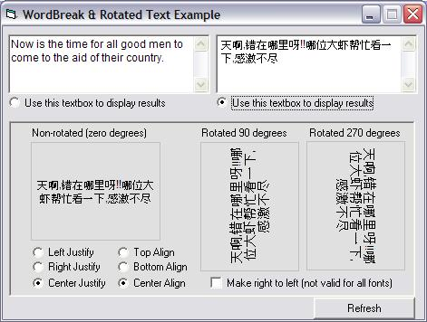



## FYI: Rotated Captions with Unicode WordBreaking

### Description

Use Windows to word break captions. Display text at zero, 90 &amp; 270 degree rotations. Neat method of wordbreaking unicode text using Windows own wordbreaking algorithms vs trying to create your own. Added several properties to mimic DrawText to include clipping, accelerator keys, and more. Project nearly 100% complete. The API created unicode textbox is not subclassed, so it isn't controlled by the project, however, you can type and cut/copy/paste as needed. Next major addition will be a class version. Hmmm, a usercontrol-less, class-based unicode textbox would be a nice project ;)
 
### More Info
 

             |
---                |---
**Submitted On**   |2007-10-24 22:51:48
**By**             |[LaVolpe](https://github.com/Planet-Source-Code/PSCIndex/blob/master/ByAuthor/lavolpe.md)
**Level**          |Intermediate
**User Rating**    |5.0 (40 globes from 8 users)
**Compatibility**  |VB 6\.0
**Category**       |[Graphics](https://github.com/Planet-Source-Code/PSCIndex/blob/master/ByCategory/graphics__1-46.md)
**World**          |[Visual Basic](https://github.com/Planet-Source-Code/PSCIndex/blob/master/ByWorld/visual-basic.md)
**Archive File**   |[FYI\_\_Rotat20884410242007\.zip](https://github.com/Planet-Source-Code/lavolpe-fyi-rotated-captions-with-unicode-wordbreaking__1-69533/archive/master.zip)

